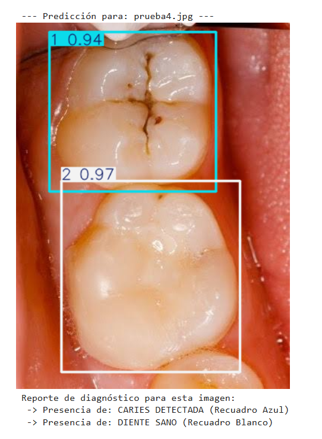
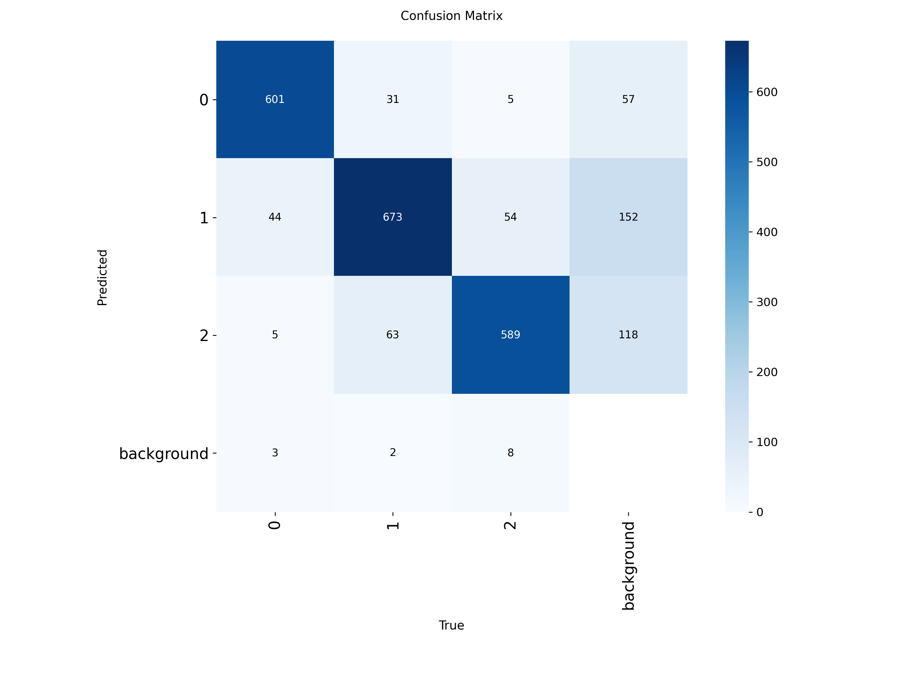

## Sistema de Diagnóstico para la Detección de Caries Dentales por modelo YOLO

## Alumna
** Vanessa Yazmin Campos Guzmán  6F  23310324

---

## Descripción del Proyecto
Este proyecto implementa un modelo de visión artificial basado en la arquitectura **YOLOv8 (You Only Look Once)** entrenado específicamente para la localización y clasificación automatizada de piezas dentales sanas y lesiones de caries en imágenes intraorales. El objetivo es proporcionar a los profesionales de la salud dental una herramienta de diagnóstico rápido que reduzca el margen de error humano y optimice los tiempos de consulta.

El conjunto de datos (dataset) fue gestionado, preprocesado y exportado utilizando la plataforma **Roboflow**, de donde se obtuvieron más de 9000 imagenes de dientes con caries (y sanos) para garantizar un etiquetado preciso de las clases y un formateo óptimo para el entrenamiento del modelo. El objetivo final es proporcionar a los profesionales de la salud dental una herramienta de diagnóstico rápido que reduzca el margen de error humano y optimice los tiempos de consulta.

---

## Estructura del Repositorio
* Entrenamiento_Caries_YOLO.ipynb: Cuaderno de Google Colab con el pipeline completo de carga de datos, entrenamiento y scripts de inferencia.
* best.pt: Pesos finales optimizados del modelo neuronal tras 25 épocas de entrenamiento.
* results.csv: Gráficas y métricas de rendimiento del entrenamiento (Precisión, Exhaustividad y Pérdida).
* confusion_matrix.png: Matriz de confusión con la efectividad de las clasificaciones.
* requirements.txt: Archivo de dependencias para la replicación del entorno local.
* prueba.jpg, prueba2.jpg, prueba3.jpg, prueba4.jpg: Imágenes de evidencia visual con las detecciones generadas por el modelo.

---

## Instrucciones de Ejecución

### Requisitos Previos
Tener instalado Python 3.8 o superior y las dependencias del proyecto. Puedes instalarlas ejecutando:

    pip install -r requirements.txt

### Ejecución de la Inferencia (Prueba)
Para poner a prueba el modelo con nuevas imágenes intraorales, ejecuta el script de inferencia incluido en el notebook principal:

    from ultralytics import YOLO
    import cv2

    # 1. Cargar el cerebro del modelo entrenado
    model = YOLO("best.pt")

    # 2. Ejecutar la detección en una imagen nueva
    results = model.predict(source="ruta_de_tu_imagen.jpg", conf=0.4)

    # 3. Desplegar los resultados en pantalla
    for r in results:
        im_bgr = r.plot()
        cv2.imshow("Diagnóstico IA", im_bgr)
        cv2.waitKey(0)

---

## Caso de Estudio: Aplicación Práctica en Entorno Real

### 1. Problema a Resolver
El diagnóstico temprano de la caries dental en superficies oclusales (fisuras de los molares) depende altamente de la agudeza visual del odontólogo y la calidad de la iluminación. Las lesiones por caries suelen pasar desapercibidas en revisiones de rutina, lo que retrasa el tratamiento preventivo y deriva en procedimientos invasivos costosos (como endodoncias). 

Este sistema resuelve la variabilidad del ojo humano mediante un análisis digital estandarizado en tiempo real, actuando como un segundo par de ojos ultrapreciso para el dentista.

### 2. Arquitectura de Hardware Propuesta
Para llevar este modelo del entorno de simulación a una clínica dental real, se propone la integración de un ecosistema de hardware compuesto por:

* Unidad de Captura (Cámara Intraoral): Una cámara dental ergonómica de alta resolución (1080p a 60 FPS) equipada con un anillo de iluminación LED de luz blanca fría (6500K) para evitar sombras y reflejos espurios dentro de la cavidad bucal.
* Unidad de Procesamiento Local: Una computadora de diagnóstico compacta equipada con una tarjeta de desarrollo NVIDIA Jetson Orin Nano (o una PC de consulta con GPU dedicada). Esto permite procesar la señal de video de la cámara en tiempo real con una latencia menor a los 45 milisegundos por cuadro.
* Interfaz de Visualización: Monitor instalado junto a la unidad dental para que tanto el médico como el paciente observen el diagnóstico interactivo en vivo.

### 3. Flujo de Funcionamiento del Sistema
El comportamiento dinámico del sistema automatizado se ejecuta bajo el siguiente flujo secuencial:

1. Captura y Transmisión: El odontólogo desplaza la cámara intraoral por la dentadura del paciente. La cámara transmite el flujo de video digital de forma continua hacia la unidad de procesamiento mediante una interfaz USB 3.0 de alta velocidad.
2. Inferencia en Tiempo Real: El script de Python recibe los cuadros de video en bucle continuo. El modelo best.pt analiza cada cuadro de forma instantánea.
3. Procesamiento de Clases:
   * Si el modelo detecta un Diente Sano, genera un cuadro delimitador Blanco (Clase 2) con su porcentaje de confianza en la pantalla de consulta.
   * Si el modelo localiza una zona con desmineralización o fosas oscuras sospechosas, activa una alerta visual instantánea dibujando un cuadro Azul (Clase 1) de "CARIES DETECTADA".

  
## Evidencias de Diagnóstico y Resultados

### Muestras de Inferencia
A continuación se muestran los resultados visuales del modelo detectando piezas sanas (recuadro blanco) y anomalías (recuadro azul):

### Métricas de Rendimiento
Gráfica que demuestra la evolución del entrenamiento y la matriz de confusión del modelo:

